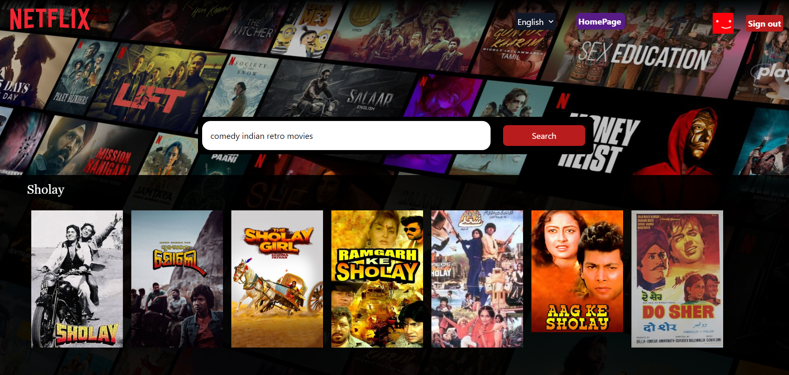

# NETFLIX-GPT

**Netflix-GPT** is a feature-rich web application built with ReactJS and Tailwind CSS. This project integrates a movie recommendation system with GPT-based search capabilities, offering users an engaging and interactive experience.

### **FEATURES**

- Header Navigation
- User Authentication
- Sign Up / Sign In Forms
- Form Validation
- Firebase Integration
  - Firebase Deployment
- Redux State Management
  - User Slice
  - Sign-Out Feature
  - Profile Update
  - Bug Fixes
- TMDB API Integration
  - Custom Hook for Now Playing Movies
  - Movie Information
  - Movie Slice
  - Trailer Video Fetching
  - YouTube Video Embedding
  - MainContainer Design
  - Secondary Container
  - TMDB IMG_CDN API
- GPT-Based Search
  - Search Bar
  - Search Suggestions
  - Multi-Language Support (BONUS)
  - GPT Toggle Feature
- Performance Optimization
  - Memoization
- Responsiveness
  - Support for Small Devices

### **GPT Features**

- **GPT Search Page:** Created a dedicated page for GPT-based search.
- **GPT Search Bar:** Implemented a search bar for GPT queries.
- **GPT Suggestions:** Added GPT suggestions for search queries.
- **Multi-Language Support (BONUS FEATURE):** Added multi-language support for the application.
- **GPT Toggle Feature:** Enabled toggling between GPT search and other features.

## Technologies Used

- **ReactJS:** `npm install react --save`
- **Tailwind CSS:** `npm install tailwindcss --save`
  - Utility-first CSS framework for modern web design.
- **React-Icons:** `npm install react-icons --save`
  - Icons from the *Feather* or *Heroicon* sections of the [React-Icons](https://react-icons.github.io/react-icons/) library.
- **Firebase:** `npm install firebase --save`
  - For authentication and deployment.
- **TMDB API:** Movie database API for fetching movie data.
- **GeMini API:** for searching purpose